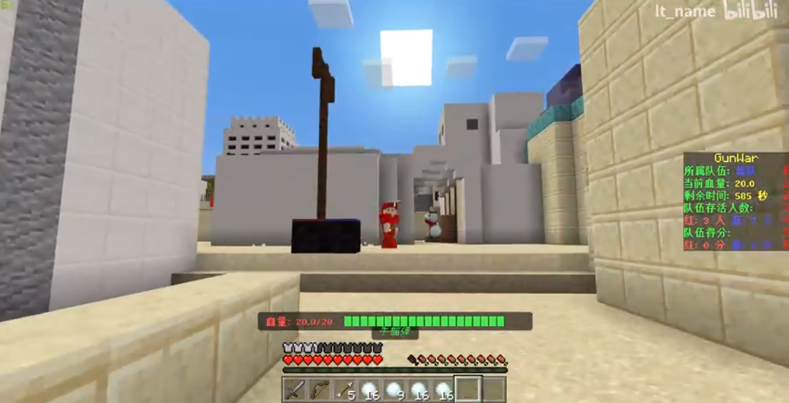
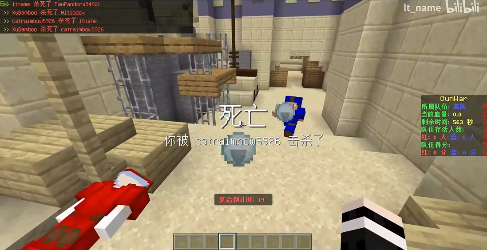
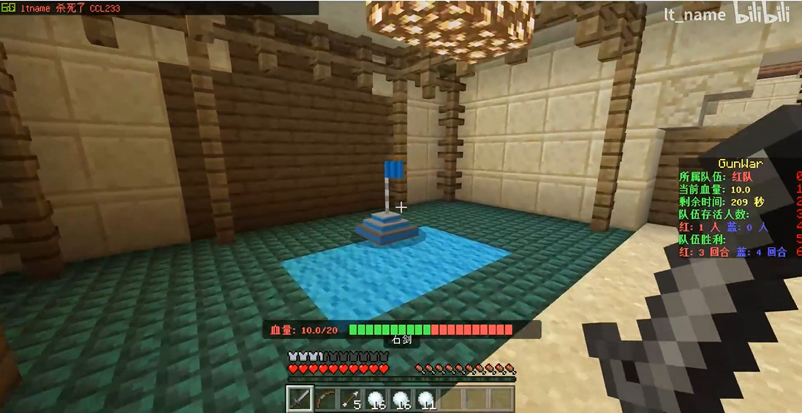

# Gunwar

## Switch between Languages?

## 介绍

枪械战争是一款普通的团队竞技游戏，拥有高达4种不同的模式供你选择。你需要去运用你手中的武器装备去打败对面以赢取胜利。本款插件操作简单、富有乐趣，同时这也是一款快节奏型的小游戏，你能成为最终的胜利者么？

## 特色

**四种不同的模式!** 包括歼灭战、团队战、爆破战和夺旗战

**排行榜系统!** 让你的每一次胜利充满成就感。你能成为排行榜中的领头者么？

**高度自定义配置!** 你可以设置玩家的初始物品，可设置原生物品，也可设置自定义的物品类型来辅助原生物品（如：近战武器，投掷武器，枪械）

**简易GUI操作!** 你可以轻松地设置或编辑每一个房间。大部分配置项都可轻松更改。

**局后执行指定指令!** 你可以奖赏或惩罚胜利或失败的玩家。

**多语言支持!** 你可以选择

## In-game Screenshots

## Bugs & Reports

If you come across any bug or problem while using it, you can report it on [Discord](https://discord.gg/pJjQDQC), or send a issue here to us.
