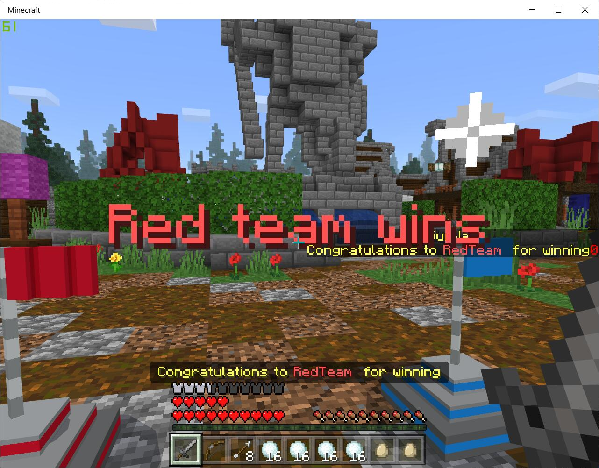
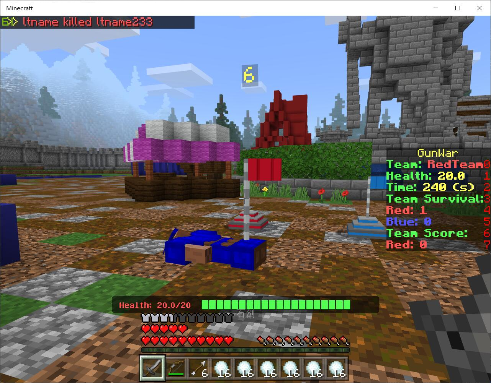
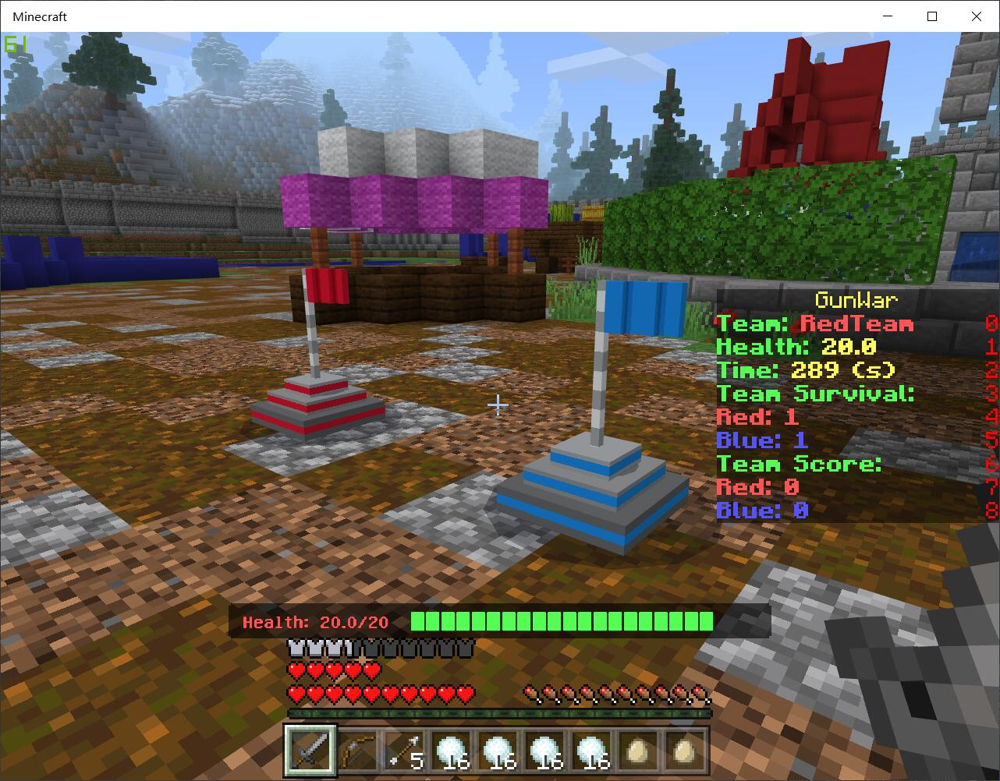

# GunWar  

## Switch between Languages?

## Intro
Gunwar is a simple team war with four different modes. You need to battle enemy team with different equipments and the ultimate target is to win the game. It is easy to manage, fun to play and extremely fast-paced and exciting game that you and your players will enjoy a lot!

## Features

**Four different modes!** Including Elimination Match, Team Death Match, Team Match, Take The Flag Match.

**Rankinglist System!** All players included. Can you be the best player of all?

**Customizable configurations!** You can set players' initial items, including vanilla items and customized items(Melee, Projectile, Weapon_gun)

**Simple GUI management!** You can easily set or modify every room. All simplified for easy configuration!

**Run given commands!** You can reward or punish your players, based on who wins and loses!

**Multi-languages support!** You can choose a existed language you like. And you can make your own language file.

## In-game Screenshots

## Bugs & Reports

If you come across any bug or problem while using it, you can report it on [Discord](https://discord.gg/pJjQDQC), or send a issue here to us.
